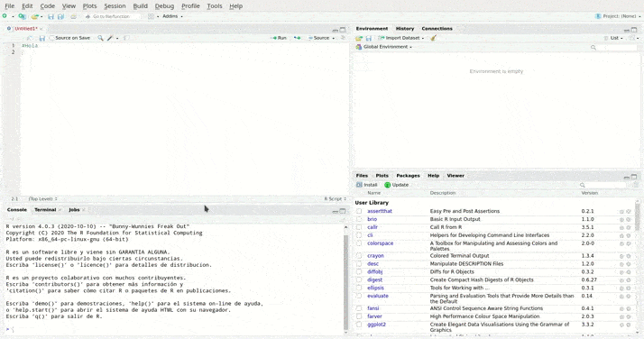

<!--
.. title: Primeros pasos con RStudio
.. slug: primeros-pasos-con-rstudio
.. date: 2021-04-05
.. author: Anavelyz Pérez
.. tags: ide, r
.. category: ide
.. link:
.. description:
.. type: text
-->

<!-- # Primeros pasos con RStudio -->

RStudio es un entorno de desarrollo integrado (IDE) para el lenguaje de
programación R, el cual puedes utilizar para realizar scripts de análisis de
datos, aplicaciones web interactivas, documentos, reportes, gráficos y mucho
más.

<!-- TEASER_END -->

<iframe
  src="https://fast.wistia.net/embed/iframe/520zbd3tij?videoFoam=true"
  style="border: none;"></iframe>

Para acceder o utilizar esta herramienta se tienen las siguientes opciones:
[RStudio Desktop](https://rstudio.com/products/rstudio/#rstudio-desktop) y
[RServer](https://rstudio.com/products/rstudio/#rstudio-server). Cada uno de
ellas tiene una en versión Open Source (código abierto) y otra Pro.

**RStudio Desktop** brinda acceso local a RStudio y tiene entre sus
funcionalidades herramientas como resaltado de sintaxis, completado de código e
indentación inteligente, te permite ejecutar el código R directamente desde el
editor de fuentes, gestionar fácilmente múltiples directorios de trabajo
usando proyectos, posee ayuda y documentación integradas de R.

Además, cuenta con depurador interactivo para diagnosticar y corregir errores
rápidamente.

**RStudio Server** brinda acceso a RStudio a través de un navegador web, acerca
el cálculo a los datos, permite hacer y tener de forma centralizada cálculos
a escala y en la RAM. Cuenta con poderosas herramientas de codificación para
mejorar la productividad.

También existe la posibilidad de trabajar con esta herramienta completamente
online a través de [RStudio Cloud](https://rstudio.cloud/) una versión web de
RStudio que te permite acceder a todas sus funcionalidades desde un buscador.
Sin embargo, en este artículo nos centraremos en RStudio Desktop.

¿Cómo instalar RStudio Desktop?

1. Debes instalar R (https://cloud.r-project.org/)
1. Acceder a la web oficial de [RStudio](https://rstudio.com/)
1. Ir a la sección Download https://rstudio.com/products/rstudio/download/
   específicamente hasta "All Installers" cerca de la parte inferior de la
   página.
1. Hacer clic en el enlace de descarga correspondiente al sistema operativo de
   su ordenador.
1. Seleccionar el archivo descargado e instalar de acuerdo a su sistema
   operativo.

Ahora, **Conozcamos la Interfaz de RStudio:**

El ambiente de RStudio es similar en todas sus versiones. Por defecto está
dividido en cuatro cuadrantes o regiones:

- El cuadrante superior izquierdo contiene una ventana que permite crear y
  editar scripts y, mostrar datos. También cuenta con una serie de comandos o
  botones asociados con la ejecución de los scripts. Lo podemos encontrar en
  algunas referencias como Source Panel. Es importante mencionar que si es la
  primera vez que abres RStudio este cuadrante no aparece hasta que se genere un
  nuevo script o se abra uno que ya haya sido generado previamente.

- El cuadrante inferior izquierdo contiene una consola, que recibe directamente
  las instrucciones y las interpreta. Luego de esto muestra el resultado. Por
  ejemplo, ingresamos 9 + 3 entonces la consola interpreta que debe hacer una
  suma y finalmente devolverá el número 7.

  En este cuadrante también encontramos el *Terminal* y la funcionalidad *Job*
  que permite mantenerse productivo mientras tu código funciona: trabajos
  locales y trabajos remotos. Puedes usarlas para ejecutar tus scripts en
  segundo plano mientras sigues usando el IDE.

- En el cuadrante superior derecho podemos encontrar el Panel de Environment
  (ambiente), Historial y las Conexiones. *Environment* muestra las
  características de variables, dataframes u objetos que se estén trabajando en
  algún proyecto o sesión determinada. También hay un botón que permite cargar
  datos a la memoria de RStudio.

  Por otro lado, en el *Historial* puedes ver las líneas de comandos que han
  sido ejecutadas recientemente, buscar mediante la caja de búsqueda o copiar
  los comandos directamente a la consola, o al script. Además es posible guardar
  el historial de comandos para utilizarlos en otra sesión.

- El cuadrante inferior derecho contiene varias pestañas:

-Files(Archivos): es un gestor de archivos propio de RStudio, te permite crear,
editar y eliminar tus archivos, así como crear carpetas.

-Plots: en esta pestaña se muestran los gráficos que se generen a través del
script o líneas de comandos. También te permite exportarlos en distintos
formatos.

-Packages: Si damos clic en esta pestaña aparecen dos botones, install y
update, seguido por una lista de paquetes que pueden estar o no instalados en tu
ordenador y que puedes usar o instalar según sea el caso.

-Help: Nos da acceso a la ayuda que está compuesta por varias secciones,

\*R Resources: Contiene una lista de enlaces que te dirigen a páginas web de
las ayudas oficiales de R.

\*RStudio: Contiene enlaces asociados a los sitios web oficiales de RStudio.

\*Manuals: Esta sección contiene los enlaces que te permiten acceder de forma
local a una serie de manuales a cerca de R.

\*Reference: Hay dos enlaces, uno es el índice de los paquetes instalados y
otro muestra una serie de palabras clave y la clasificación por tópicos de
paquetes; al hacer clic en cualquiera de estos enlaces la información es
cargada de forma local.

\*Miscellaneous Material: Muestra material diverso sobre R, tal como manuales
de usuario, preguntas frecuentes, Acerca de R, entre otros.

-Viewer: esta pestaña es complemento de la extensión RMarkdown, la cual permite
tener una vista previa de los archivos .rmd.

Nota: Los cuadrantes se pueden agrandar o reducir. Permitiendo ajustar la
pantalla a tus necesidades.

La barra de menú tiene opciones asociadas con los archivos, proyectos y
carpetas, puedes crearlos, editarlos y/o eliminarlos (File), edición de código
en el Source Panel o Consola (Edit), ejecución de código y scripts (Code),
visualización y ajustes de las ventanas (View), herramientas asociadas a los
gráficos generados (Plots), opciones asociadas con la sesión actual(Session),
construcción (Build), depuración(Debug), Perfiles del usuario (Profile),
herramientas para instalar paquetes, versiones y otros elementos asociados al
terminal y (Tools), al igual que la pestaña help te permite acceder a una serie
de materiales informativos de ayuda (Help).

**Descargar e instalar paquetes**

Para descargar e instalar uno o varios paquetes directamente desde RStudio debes
dar clic en la pestaña packages específicamente en el botón install y escribir
en la pantalla que aparecerá el o los nombres de los paquetes que deseas
instalar. En el caso de que sea más de un paquete, los nombres de estos se deben
escribir de forma tal que estén separados por un espacio o una coma.

También puedes descargar los paquetes desde R-cran e instalarlos desde RStudio.

**Buscar o ubicar Tutoriales y material de apoyo sobre R y RStudio**

La comunidad de R es bastante amplia, por tanto, tendrás acceso a una serie de
contenidos educativos muy completos. En el ambiente de RStudio como se mencionó
anteriormente, podemos encontrar la sección de ayuda en la cual hay diversos
links o enlaces que te permiten acceder a estos sitios.

RStudio tiene una [página web](https://education.rstudio.com/) diseñada
especialmente para al aprendizaje y enseñanza de R y RStudio. Tiene cuatro
secciones principales: [Un blog](https://education.rstudio.com/blog/), [aprende](https://education.rstudio.com/learn/), [enseña](https://education.rstudio.com/teach/) y [certificate](https://education.rstudio.com/trainers/). Si eres completamente
nuevo en R, la subsección Beginners
https://education.rstudio.com/learn/beginner/ es ideal para ti.

Entre las recomendaciones en Beginners se encuentra un grupo de chicas de Sydney
desarrollaron un blog y una serie de contenidos que pueden orientarte sobre el
lenguaje R y la interfaz RStudio. Aquí el enlace: https://rladiessydney.org/.

Otro elemento web que puede ser útil es
[R-Básico](https://r-basico.aprendr.org/index.html). Un repositorio de
información en Español sobre R y RStudio y de la cual se ha extraído información
para este artículo.
