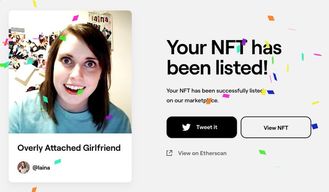

<!--
.. title: NFT. Más que un JPG
.. slug: ciencia-abierta
.. date: 2019-04-08
.. author: Alan Hurtarte
.. tags: nft, blockchain
.. category: nft
.. link: 
.. description: 
.. type: text
-->

<!-- # NFT. Más que un JPG -->
<!-- **Autor**: [Alan Hurtarte](../../authors/alan-hurtarte.md) -->

Quizá hayas escuchado el término NFT últimamente. Títulos de noticias descabelladas como [«Porque este CryptoPunk NFT  fue vendido por \$532 millones de USD»](https://www.cnet.com/news/why-this-cryptopunk-nft-sold-for-532-million-sort-of/) o [«Memes clásicos que fueron vendidos como NFT»](https://mashable.com/article/classic-memes-sold-nft-prices).

En este último artículo, se hace mención al meme de la «novia posesiva» que fue vendido por \$411,000.00 USD.

<!-- TEASER_END -->

## Pero, ¿Qué es un NFT?

Equivocadamente, se entiende como un JPG, o sea, un archivo de imagen. Si le doy click derecho y "guardar imagen", ¿también tendría el NFT?, y ¿gratis?.

Recientemente, se hizo viral el hecho de que en un torrent estaban todos los NFTS actuales, una colección billonaria, descargable para cualquiera.

NFT es mucho más que una imagen, o un video, o una canción. Es la representación digital de una propiedad. Imagina un sistema totalmente independiente, inmutable, donde se reconoce tu propiedad. Por el momento lo que está pegando, es arte, más específico, artes visuales digitales (imágenes y videos). Sin embargo, no te extrañes ver campañas de NFT que sean mucho más que imágenes, que podrían ser canciones, películas, cortos y lo que puedas imaginar digital.

Dejando claro que es mucho más que una imagen, entonces podemos decir que un NFT es un registro de propiedad, validado por una cadena de bloques, descentralizada e inmutable, que nunca caducará. Creo que en este punto la pregunta es: ¿Qué no podría ser un NFT?, bueno, hay muchas cosas que no pueden ser digitales, pero imagina todo lo que sí pueden, y todo lo que ya lo es.

Leí el caso de un músico que creó su proyecto, su propio token, en vez de ser bitcoin o eth, y lo usó para juntar fondos para su disco. Los fans pudieron dar apoyo a su artista favorito, colaborando a su crowdfunding, y obtienen cierta cantidad del token del artista (un NFT). Al tener ingresos por su nuevo álbum, el artista le dio parte de las regalías a los que tenían los NFTs.

Podrás leer más aquí: [NFTs are revolutionizing the music industry too](https://fortune.com/2021/10/29/nfts-music-industry/). Esto nos lleva a lo que realmente mueve la web 3.0, propiedad de nuestros bienes digitales (ownership).

Lo cierto es que, el NFT le viene a dar más poder e independencia al artista. Jack Conte, el CEO de Patreon, es un músico independiente que notó un fenómeno: se esforzaba minuciosamente por hacer sus videos musicales, le metía todo su dinero para hacer sus videos creativos, con stop motion, y proyecciones, y nada pasaba, unas cuantas vistas en sus videos de youtube. Luego notó que a pesar de tener éxito en youtube, y que la gente llegaba a sus presentaciones, no lograba ser económicamente sostenible. Tienes talento, tienes fans, y entregas constantemente tu arte, ¿Qué es lo que falta?.

El modelo de negocio actual se trata del intermediario. Amazon no hace dinero fabricando productos, AirBnb no hace dinero alquilando sus propiedades, Uber no hace dinero con sus propios autos. Todos son intermediarios, y sus modelos de negocio les permiten ganar mucho dinero manejando el uso de la propiedad ajena. Lo mismo pasaba con Jack y youtube, así que creó Patreon, una plataforma en la que los fans apoyan al artista directamente. Para mí esta es la primera versión de la revolución del arte, y el NFT solo va a venir a acelerarlo. Imagina que ser artista o creador de contenido, ya no sea una carrera en las que tus familiares te dirían «de eso no vas a poder vivir», «pero necesitas una carrera de verdad».

## ¿Estamos ante una burbuja?

Hay muchas opiniones al respecto, y como en cualquier tema te recomiendo hacer tu propia investigación y llegar a tus propias conclusiones, especialmente si hay dinero en juego.

Personalmente, pienso que si esto es una burbuja, los precios son ridículamente altos y eventualmente se normalizarán.

Es importante entender que, la burbuja aquí es el precio, no la tecnología, y esta tecnología vino para quedarse.

La burbuja de las “.com” es algo que resuena cuando se habla de este punto. Cuando vino la tecnología de la web 2.0, se creó una burbuja, que explotó y apenas 2 de cada 10 compañías sobrevivieron. Sin embargo, la tecnología se quedó, y nos dio los gigantes tech que tenemos hoy en día como: google, facebook, twitter, etc.

Claro, el NFT actual hace una intersección entre dos mundos que no todos tenemos acceso, el invertir cantidades ridículamente altas de dinero en arte, y la tecnología disruptiva que no está lista para ser mainstream. Si le quitamos la tecnología, solo nos queda gente gastando un montón de dinero en representaciones visuales que son interpretadas. Y eso ya pasa, hay pinturas y arte moderno que hoy en día se venden por precios ridículamente altos. Así que el consejo es, no le busques el sentido al precio del arte, entiende la tecnología por detrás, y no te dejes engañar o cegar por JPGs de millones de dólares.
