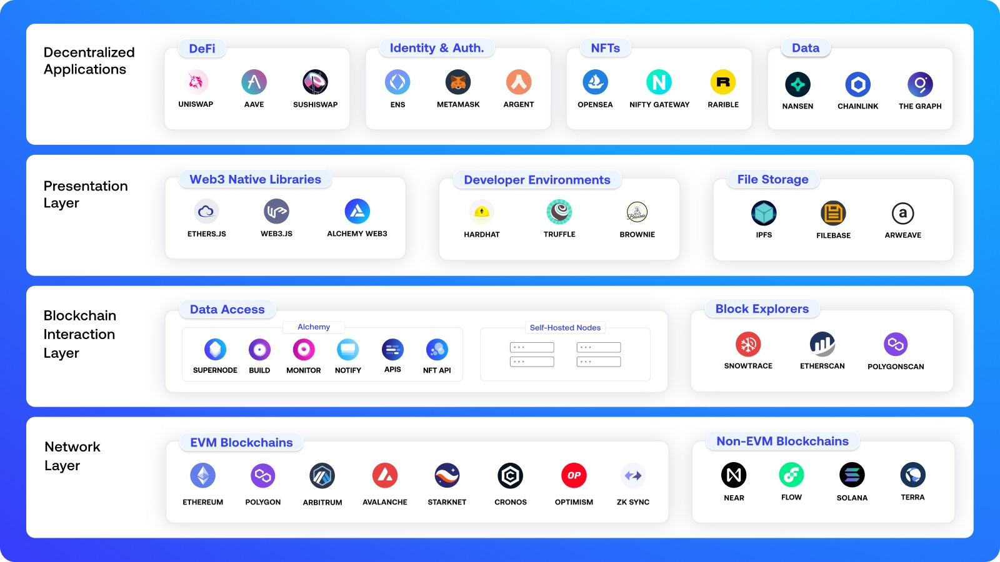
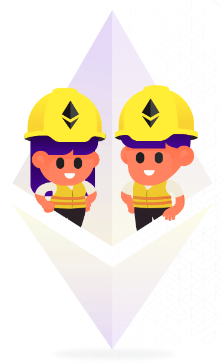
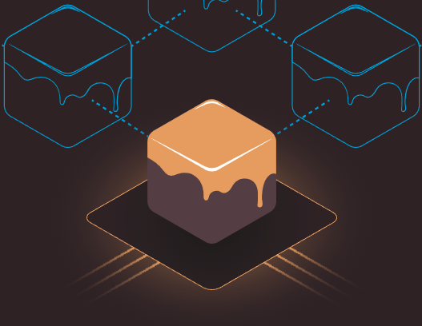

<!--
.. title: Que necesitas para desarrollar en la web3
.. slug: que-necesitas-para-desarrollar-en-la-web3
.. date: 2022-03-
.. author: Alan Hurtarte
.. tags: crypto,roadmap,env,developer,web3
.. category: open science, web3
.. link: 
.. description: 
.. type: text
-->
<!-- # Que necesitas para desarrollar en la web3 -->
<!-- **Autor**: [Alan Hurtarte](https://opensciencelabs.github.io/articles/authors/alan-hurtarte.html) -->



# Como desarrollador, ¿Que necesito para desarrollar en la web3?

Si ya eres desarrollador y tienes la meta, el deseo, o simplemente la curiosidad de adentrarte en la web3, en este blog te mencionare las tecnologías que se utilizan en el tech stack para desarrollar.

Empezemos con un esquema básico, la web3, no funciona diferente de la web normal en teoría, lo que cambia es que en vez de tener un solo lugar centralizado con nuestros datos en el backend, esta disperso por los nodos, ya sea directo en los smart contracts (si fuera Ethereum) o en el uso de algún servicio [IPFS](https://web3.storage/). Mientras el frontend es lo mismo que ya usas. Html, Css, JS, React, vue o cualquier otro frontend framework.

Es importan destacar que la web3 no es excluyente de las tercnologias existentes. Puedes tener tu backend en nodejs, php, java, .net, python o el que prefieras y aún asi interactuar con servicios web3.

## Desarrollo local
Así como en la web2, tienes tu desarrollo local, ya sea con docker o con instaciones de tu servidor en el localhost. En el web3 tenemos herramientas como [hardhat](https://hardhat.org/) o [ganache](https://trufflesuite.com/ganache/index.html)

### Hardhat

Es una herramienta para correr solidity localmente. Encuentras facil para hacer deploy de tus contratos, correr tests y debuguear codigo en solidity en diferentes versiones.
<br />
Se corre como un paquete global de nodejs que se instala con npm

```
npm install --save-dev hardhat
```

<br clear="left"/>
<br />

### Ganache (Truffle Suite)

Blockchain en un click. Con ganache pueden lanzar rapidamente un blockchain personal para correr tus tests, e inspeccionar el estado mientras controlas como la cadena opera.

Para instalarlo se debe correr un ejecutable y se instala como cualquier otra aplicación en tu sistema.
<br clear="left"/>
<br />
## Perfecto, ya esta mi blockchain, ¿Ahora que?
Listo, cada herramienta tiene su modo de publicar o desplegar tus contratos a tu red local.
Por ejemplo, con hardhat:
```
npx hardhat compile
```
Con ganache, se debe usar otra herramienta de la misma familia llamada truffle, y se ejecuta de la misma manera que hardhat
```
npm install truffle -g
```
y luego para compilar
```
truffle compile
```

<br />

Al tener tu contrato desplegado ya podras intereactuar con él, usando web3.js o ether.js. En otras palabras, ya se trata del frontend.

### Web3 JS

Web3.js es la herramienta que maneja toda la logica para conectarnos a nuestros smart contracts. Al compilar un contrato se crea un archivo llamado  [abi.json](https://docs.ethers.io/v5/api/utils/abi/formats). Este archivo expone todos tus metodos publicos de tu smart contract, junto con los parametros y tipos que espera. De esa manera tu frontend se podra comunicar de manera exitosa con tus contratos.  


La menara en que funcionan es por pasos:
1. Instancias una referencia a tu archivo abi. Recuerda que este es el que sabe el como, cuando y donde, de la  comunicación con tus contratos.
2. Al tener la referencia de tu abi, puedes acceder por notación de objetos a tus metodos 

```
// Importamos el abi del contrato
import abi from "./utils/EtherFavoriteSongs.json";
this.contractABI = abi.abi;

...

// Obtenemos la referencia a la billetera del usuario
const provider = new ethers.providers.Web3Provider(ethereum);
const signer = provider.getSigner();

// Creamos una nueva instancia del contrato
const favoriteSongsPortalContract = new ethers.Contract(this.contractAddress, this.contractABI, signer);

// El método getTotalSongs esta definido en nuestro contrato de solidity
let count = await favoriteSongsPortalContract.getTotalSongs();
```

Así de facíl podemos conectar nuestro nuevos contractos con nuestro viejo y confiable frontend. 

El codigo completo de este ejemplo esta en este [repositorio](https://github.com/kenny08gt/ether-favorite-songs)

## Billetera (wallet)
La diferencia entre web2 y web3 es que el usuario se identifica con una "billetera", este es un termino que no representa realmente lo que es y puede confundir a personas nuevas o que no tienen interes financiero en el blockchain. La mas popular de estas herramientas es [metamask](https://metamask.io/), que te deja tener una dirección hexadecimal unica, y puedes generar multiples direcciónes. Cada una de estas te sirve para identificarte con aplicaciones web3. En vez de tener que hacer login con tu correo una y otra vez, solo debes conectar tu dirección (en tu billetera) y ya puedes interactuar con la web3.  


Estas billeteras son gratuitas y se instalan en segundos. Puede ser como extensión en tu navegador o aplicaciones individuales.


Esto es fundamental para el funcionamineto de la web3. Cada interaccion con el blockchain queda firmado por quien hizo la petición. Así queda todo registrado en el blockchain.

## Resumen
- Necesitas una blockchain local para tu desarrollo
- Necesitas compilar tus contratos.
- Necesitas un frontend, con lo que ya puedas saber o aprender sobre frontend. Html, css, js, react o vue js.
- Necesitas una billetera para interactuar con tus contratos.


El ecosistemas sigue creciendo aceleradamente, cada vez hay mas herramientas y se van completando los vacios. Todavia hace falta mucho product design, y desarollo para volverlo mainstream. 