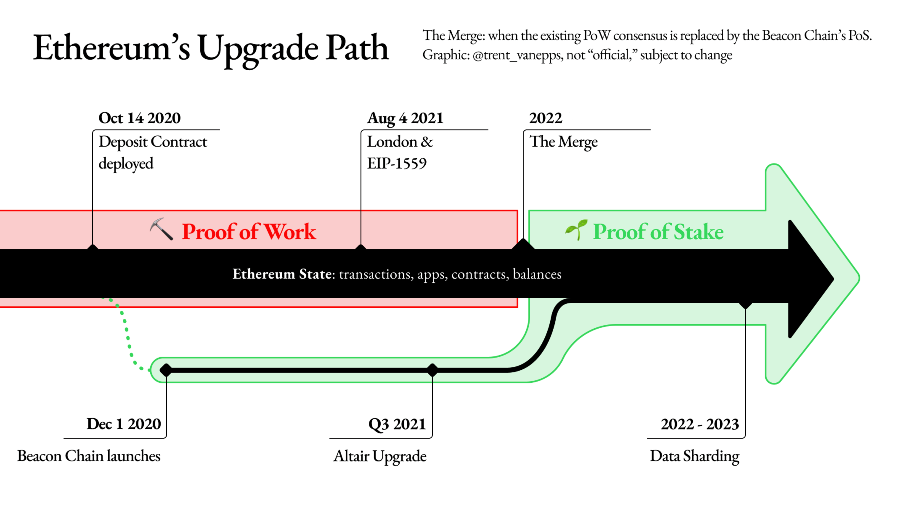

<!--
.. title: Ethereum merge is coming. ¿Pero que significa?
.. slug: ethereum-merge-is-coming-pero-que-significa
.. date: 2022-03-22
.. author: Alan Hurtarte
.. tags: crypto,ethereum,merge,web3
.. category: open science, web3, ethereum
.. link:
.. description:
.. type: text
-->
  
 

# The Ethereum merge is coming. ¿Pero qué significa?

Oh sweet summer child, Ethereum ya no será el mismo, está evolucionando, al mismo tiempo que todo el ecosistema. No es secreto que todo el ecosistema crece, y a una velocidad agigantada. La masiva adopción de Ethereum trajo consigo problemas a la red como:
* Transacciones con gas demasiado alto (provocando transacciones de alto costo)
* Transacciones demasiado lentas. No te puedes imaginar pagar un café o una hamburguesa con Ethereum si el proceso tarde 5 o 10 minutos en validarse.
* Debido a las dos anteriores, demasiado consumo de energía eléctrica.

Estos problemas lo sufren las dos blockchains más grandes del momento, bitcoin y Ethereum. En el caso de bitcoin, la solución es ligthing network. Para Ethereum, es este merge.

Este puede ser uno de los cambios más esperado por la comunidad, trae consigo un gran cambio en el modo en que valida las transacciones, actualmente utiliza un mecanismo llamado POW (proof of work) y cambia a un mecanismo llamado POS (proof of stake). Este cambio mejorará la descentralización y el reducir bastante el consumo de energía que con eso traerá menores costos.

### Proof of work VRS Proof of stake

El concepto de **Proof of Work** existe desde antes de los crypto assets. La primera idea fue publicada por Cynthia Dwork y Moni Naor en un artículo publicado en 1993, sin embargo, no fue hasta 1999 que el término "Proof of work" fue creada por Markus Jakobsson.

Pero, ¿Por qué se usa esto?. En el white paper de bitcoin, Satoshi Nakamoto teoriza que la única manera de vulnerar la fuerza de la red de bitcoin es a través de un ataque del 51% de la red. Por eso, propone el uso de proof of work para prevenir una entidad de ganar un control mayoritario sobre la red. Al aplicar proof of work en este sentido, se argumenta es la idea central necesaria para bitcoin, ya que permite un sistema de consenso realmente honesto y distribuido.

Así es como funciona actualmente bitcoin y Ethereum con el proof of work:
1. Un grupo de transacciones son agrupadas en un memory pool (mempool).
2. Los mineros verifican cada transacción en el mempool que se legitima al resolver un problema matemático.
3. El primer minero en resolver el problema obtiene una recompensa con un nuevo bitcoin recién minado y el costo de la transacción.
4. El mempool verificado, ahora llamado bloque, es añadido a la blockchain.

Ahora el **Proof of Stake**, tiene el mismo propósito de validar transacciones y conseguir un consenso; sin embargo, se diferencia de proof of work, ya que no involucra un problema matemático a resolver. Ahora el validador de cada bloque se escoge determinísticamente basado en su **stake**. El stake es cuantas monedas/tokens posee. Ya podrás suponer que al no tener que resolver un problema matemático, la eficiencia energética de este sistema es mucho mayor, y esto lleva a menores costos de transacción. Además, que este sistema puede proveer un mejor incentivo para la salud de la red, al promover acumular moneda/tokens.

### Porque del merge
Ethereum tiene muchos problemas, y este merge busca solucionar el blockchain trilemma
* Seguridad
* Descentralización
* Escabilidad

### Que beneficio trae el merge
* Descentralización y seguridad: El merge quire un minimo de nodos y haces más fácil de correr un nodo. Para correr un nodo necesitas tener 32 ETH.
* Sostenibilidad: Proof of stake usa al menos 99% menos energía que proof of work.

## ETH 2.0

Este cambio en Ethereum ya venía siendo discutido desde el 2018, y había sido añadido al roadmap, pero se dieron cuenta de varias cosas:
* Tomaría años en entregar por completo el roadmap.
* Hacer el cambio completo de PoW a PoS, requeriría una migración por parte de las aplicaciones existentes

Entonces surgió la propuesta Eth1+Eth2 = Ethereum. Donde:
* Eth1 = Execution Layer (actual red)
* Eth2 = Consensus Layer (el merge)

El Consensus Layer es donde estará implementado el PoS, de esa manera se podrá aplicar el merge, sin requerir cambios en los usuarios actuales de la red. Este cambió lo explican más a fondo aquí [The Great TH2 renaming](https://blog.ethereum.org/2022/01/24/the-great-eth2-renaming/).

## Conclusión
Para el usuario final no significará un cambio en billetera o en como interactúa con la red. Pero si verá los beneficios al tener transacciones más rápidas y de menor costo. Esto nos acercará a una blockchain más útil para el día a día, intercambiando valor. Es emocionante ver los cambios suceder y como se va mejorando el ecosistema. 

## Fuentes
* [The great renaming](https://blog.ethereum.org/2022/01/24/the-great-eth2-renaming/)
* The Ethereum merge is comming thread - https://twitter.com/JackNiewold/status/1506779959242764288
* The Ethereum merge - https://ethereum.org/en/upgrades/merge/#main-content
* Pow and Pos explained - https://hackernoon.com/consensus-mechanisms-explained-pow-vs-pos-89951c66ae10
