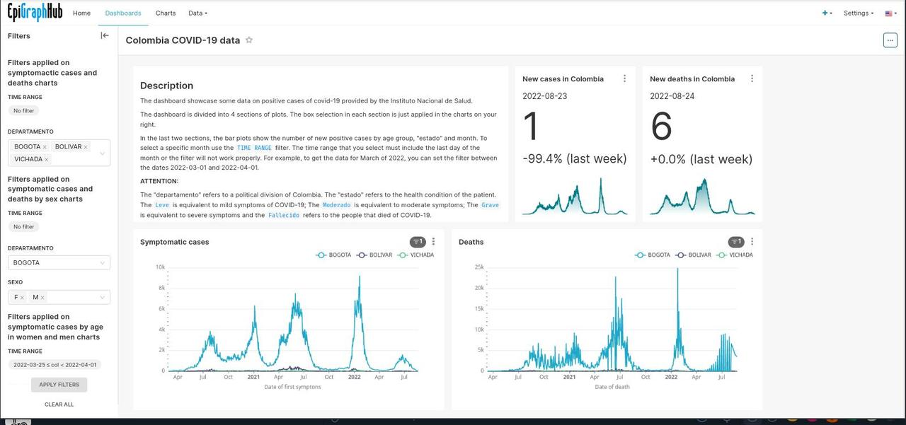

<!--
.. title: Crea una aplicación web eficiente y atractiva para el manejo, exploración y visualización de datos con Apache Superset
.. author: Yurely Camacho
.. tags: Visualización, dashboard, Superset, BI, SQL
.. category: open science
.. link: 
.. description: 
.. type: text
-->

<!-- # Crea una aplicación web eficiente y atractiva para el manejo, exploración y visualización de datos con Apache Superset-->
<!-- **Por Yurely Camacho** -->

#
Fuente:[Apache Superset](https://superset.apache.org/)

Si eres analista o científico de datos, investigador, trabajas en un
equipo de inteligencia de negocios o simplemente estás buscando una
plataforma atractiva que te permita explorar y visualizar tus datos de
manera rápida y eficiente a gran escala; aquí te presentamos Apache
Superset. Conoce con nosotros sus características más importantes, las
funcionalidades que ofrece, algunas empresas que lo utilizan y cómo
hacer tu primer gráfico y dashboard.

<!-- TEASER_END -->

## ¿Qué es Apache Superset?

Es una plataforma moderna muy utilizada en equipos de inteligencia de
negocios. Una aplicación web de código abierto implementada en Python
que está en período de incubación en [The Apache Software Foundation
(ASF)](https://www.apache.org/) y es patrocinada por [Apache
Incubator](https://incubator.apache.org/). Cuenta con una interfaz
simple y permite al usuario crear y compartir dashboards, explorar,
filtrar y organizar datos a gran escala, esto significa que puedes
modificar la aplicación según tus necesidades.

Esta iniciativa comenzó en Airbnb en 2015 como un proyecto de hackathon
y se unió al programa Apache Incubator en 2017. Para 2021, la Apache
Software Foundation anunció que Superset era un proyecto de alto nivel.
Puedes encontrar el proyecto alojado en
[GitHub](https://github.com/apache/superset).

## Características y funcionalidades

- Es intuitivo y rápido.

- Brinda una amplia variedad de opciones de gráficos y consultas que
  facilitan la exploración y visualización de datos. Así como la
  creación de reportes basados en datos.

- Es utilizado por usuarios de todo tipo de conocimientos. No necesitas
  ser experto en programación o SQL para usarlo.

- Permite la creación de dashboards interactivos y gráficos sin escribir código.

- Es compatible con la mayoría de fuentes de datos basadas en SQL a
  través de SQLAlchemy, entre ellas: [Amazon
  Redshift](https://aws.amazon.com/es/redshift/),
  [druid](https://druid.apache.org/),
  [ClickHouse](https://clickhouse.com/),
  [databricks](https://www.databricks.com/),
  [MySQL](https://www.mysql.com/),
  [SQLServer](https://www.microsoft.com/en-us/sql-server),
  [SQLite](https://www.sqlite.org/index.html),
  [PostgreSQL](https://www.postgresql.org/), entre otras. Puedes
  consultar esta [lista con todas las fuentes de datos que soporta
  Superset](https://superset.apache.org/docs/databases/installing-database-drivers/).

- Ofrece un entorno llamado **SQL Lab** que permite hacer consultas SQL
  para la exploración de los datos antes de la representación gráfica.

- Proporciona un sencillo e intuitivo constructor de vizualizaciones sin
  código que te permite personalizar tus gráficos.

- Tiene una arquitectura nativa de la nube. Permite escalar a grandes
  entornos distribuidos y funciona bien dentro de contenedores. Es
  flexible y permite elegir el servidor web, motor de base de datos,
  cola de mensajes, backend de resultados y capa de almacenamiento en
  caché.

- Su instalación y configuración es rápida.

- Permite trabajar con grandes configuraciones de *data lake* y *data warehouse*.

- Brinda un modelo de seguridad con reglas complejas que pueden
  configurarse de acuerdo a quién puede acceder y a qué características.
    
- Tiene la posibilidad de añadir plugins de visualizaciones personalizados.

Hemos visto una gran cantidad de ventajas y funcionalidades que ofrece
Superset. Debido a esto, exste una gran variedad de industrias y
empresas que utilizan Superset en sus tareas, entre ellas se encuentran:
[Airbnb](https://es.airbnb.org/), [American
Express](https://www.americanexpress.com/),
[Netflix](https://www.netflix.com/ve/), [Udemy](https://www.udemy.com/),
[Twitter](https://twitter.com/). Puedes consultar una lista más amplia
[aquí](https://github.com/apache/superset/blob/master/RESOURCES/INTHEWILD.md)

## EpiGraphHub: un ejemplo de Superset

[EpiGraphHub](https://dash.epigraphhub.org/superset/welcome/) es una
aplicación web para el manejo y visualización de datos de salud pública.

Fuente:[EpigraphHub Superset](https://dash.epigraphhub.org/superset/welcome/)

Allí puedes crear una cuenta o ingresar con la cuenta de invitado para
la cual el usuario y la contraseña es *guest*. EpiGrapHub Superset te
ofrece una variedad de dashboards referentes, entre otras cosas, a datos
de COVID en distintos países y continentes donde se visualizan
características importantes en cada caso (sexo, fecha, grupos de edad,
número de casos positivos, división política, estado de salud, entre
otras). Podemos explorar estos datos a través de sus servidores. A
continuación te mostramos un dashboard en el Superset de EpiGraphHub.

Fuente:[EpigraphHub Superset](https://dash.epigraphhub.org/superset/welcome/)

Puedes conocer más sobre EpiGrapHub en nuestro artículo: [EpiGraphHub:
un proyecto de código abierto para el análisis de datos de
calidad](https://opensciencelabs.org/blog/epigraphhub/epigraphhub-un-proyecto-de-c%C3%B3digo-abierto-para-el-analisis-de-datos-de-calidad/)

## Cómo inciar con Superset

A continuación te presentamos algunas formas diferentes de empezar con Superset:

- Descarga el [código fuente del sitio web de The Apache
  Foundation](https://dist.apache.org/repos/dist/release/superset/)

- Descarga la [última versión de Superset desde
  Pypi](https://pypi.org/project/apache-superset/)
  
- Configura Superset localmente con un comando usando [*Docker
  Compose*](https://superset.apache.org/docs/installation/installing-superset-using-docker-compose/)

- Descarga el *Docker image* desde
  [Dockerhub](https://hub.docker.com/r/apache/superset)

- Instala la [última versión de Superset desde
  GitHub](https://github.com/apache/superset/tree/latest)

Puedes consultar sobre la instalación y configuración de Superset
[aquí](https://superset.apache.org/docs/installation/installing-superset-using-docker-compose).

## Una introducción a cómo crear tu primer dashboard

Si vas a utilizar Superset para tu flujo de trabajo de análisis y
exploración de datos, a continuación te mostramos algunos pasos
necesarios que te permitirán crear un gráfico y guardarlo en un
dashboard en esta aplicación. Puedes consultar un paso a paso más
detallado sobre esto en la [documentación oficial de
Superset](https://superset.apache.org/docs/creating-charts-dashboards/creating-your-first-dashboard/).

- **Conectar Superset a una nueva base de datos**. Como Superset no
  puede guardar los datos, debe conectarse a nuestra base de datos
  existente que soporte SQL. Inicialmente debemos añadir las
  credenciales de conexión a esa base de datos para poder consultar y
  visualizar los datos.

  Este paso puede obviarse si se utiliza Superset localmente a través de
  Docker compose. Esto se debe a que está incluida y preconfigurada una
  base de datos Postgres, llamada *examples* a nuestra disposición.

  Para hacer la conexión, seleccionamos la opción *Databases* del menú
  *Data* y seguimos los pasos para crear y probar la conexión.

- **Registrar una tabla en la base de datos**. Ahora seleccionamos las
  tablas específicas (denominadas *datasets* en Superset) que deseemos
  explorar en Superset. Esto lo hacemos seleccionando la opción *Data*,
  luego *Datasets* y nuevo dataset (en la esquina superior derecha).
  Seleccionamos la base de datos, el esquema, la tabla y añadimos estos
  cambios.

- **Personalizar las propiedades de las columnas**. Se configuran las
  propiedades de las columnas como: tipo de dato, si la columna es
  temporal, si debe ser filtrada, si es dimensional, cómo debe tratarla
  Superset si es una columna de fecha-hora, entre otras. Esto se hace
  para saber cómo deben tratarse las columnas del *dataset* al momento
  de la exploración.

- **Capa semántica de Superset**. Esta capa nos ofrece mejoras como
  analistas, puede almacenar 2 tipos de datos calculados:

  1. *Métricas virtuales*: podemos escribir consultas SQL con funciones
    de agregación para varias columnas y colocar los resultados como
    nuevas columnas disponibles para la visualización.

  2. *Columnas calculadas virtuales*: también podemos hacer consultas
     SQL que involucren cambios en la apariencia o el comportamiento de
     una columna específica, por ejemplo, cambiar el tipo de dato que
     almacena. No debemos usar funciones de agregación, como SUM, en las
     columnas calculadas.

- **Crear gráficos en la vista de exploración**. En Superset podemos
  explorar los datos utilizando dos interfaces:

  1. *Explore*: es un constructor de vizualizaciones sin código. Es tan
     simple como seleccionar el *dataset*, el tipo de gráfico que
     corresponda, lo personalizamos y lo publicamos.

  2. *SQL Lab*: es un IDE (Entorno de Desarrollo Integrado) que nos
     permite preparar y unir los datos que son tomados en el flujo de
     trabajo de *Explore*.

  Para crear un gráfico, si estamos en la pestaña *Datasets* hacemos
  clic en el nombre del dataset y así inicamos el flujo de trabajo de la
  vista *Explore*. Aquí se muestra *una vista del dataset* con una lista
  de las columnas y las métricas (en el lado izquierdo). También se
  observa una *vista previa de los datos* en la parte inferior. Esta
  vista contiene las pestañas *Data* y *Customize* (datos y
  personalizar, respectivamente), a partir de allí podemos interactuar
  cambiando el tipo de visualización, seleccionando distintas métricas
  para mostrar los datos y personalizando la estética del gráfico. Cabe
  resaltar que cada vez que hacemos un cambio, debemos ejecutarlo
  haciendo clic en el botón *RUN* de la parte superior.

- **Guardar un gráfico en un dashboard**. Luego de crear el gráfico lo
  guardamos haciendo clic en el botón *Save* en la parte superior de la
  vista. Podemos guardarlo y añadirlo a un dashboard existente o a uno
  nuevo. Para publicarlo, hacemos clic en *Save and goto Dashboard*.
  Podemos cambiar el tamaño del gráfico, haciendo clic en el botón del
  lápiz en la esquina superior derecha. 
  
Y !Esto es todo! hemos creado un gráfico y lo añadimos a un dashboard en
Superset. Existen muchas opciones de configuración y visualización de
datasets, es cuestión de que comiences a probar y explorar y te
sorprenderás de lo que puedes lograr con esta plataforma.

### Otros recursos

- [Documentación de Superset](https://superset.apache.org/docs/intro/).

- Consulta el
  [CONTRIBUTING.md](https://github.com/apache/superset/blob/master/CONTRIBUTING.md)
  del proyecto si estás interesado en contribuir que contiene también
  una guía detallada sobre cómo configurar un entorno de desarrollo.  

### Referencias

- [Website de Apache Superset](https://superset.apache.org/)

- [Documentación oficial de Apache
  Superset](https://superset.apache.org/docs/intro/)