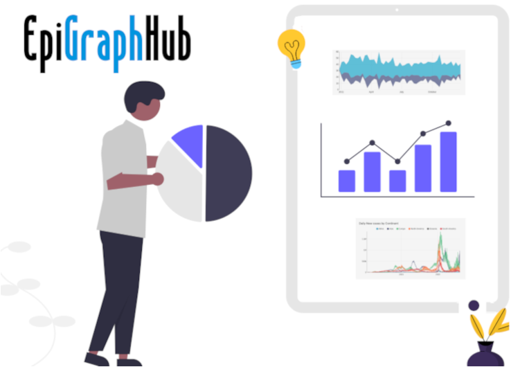

<!--
.. title: EpiGraphHub: un proyecto de código abierto para el análisis de datos de calidad
.. slug: epigraphhub-un-proyecto-de-código-abierto-para-el-analisis-de-datos-de-calidad
.. date: 2022-09-28
.. author: Anavelyz Pérez
.. tags: epigraphhun, código abierto, visualización, datos, datasets
.. category: código abierto
.. link: 
.. description: 
.. type: text
-->

<!-- # EpiGraphHub: un proyecto de código abierto para el análisis de datos de calidad -->
<!-- **Por Anavelyz Pérez** -->

## agregar imagen

# EpiGraphHub: un proyecto de código abierto para el análisis de datos de calidad

¿Quieres realizar un análisis y no encuentras datos?, ¿quieres realizar visualizaciones como dashboards o gráficos?, o simplemente explorar, ¿cómo puedes analizar datos?
Entonces este artículo es para ti. Vamos a describir EpiGraphHub, un proyecto de código abierto orientado al análisis de datos de calidad.

<!-- TEASER_END -->

## ¿Qué es EpiGraphHub?

Es una plataforma de código abierto que integra y permite gestionar datos de diversas fuentes. Fue diseñada principalmente para describir datos de salud pública, pero incluye otros tópicos como socio-economía, demografía o censos. Esto es posible porque posee conectores a muchas bases de datos y conjuntos de datos abiertos.

Con EpiGraphHub podemos hacer exploraciones rápidas y dashboarding (gráficos interactivos). Además, puede servir como backend de datos para apps analíticas.

Sus funciones de visualización están impulsadas por [Apache Echarts](https://echarts.apache.org/), está compuesta por un servidor de bases de datos Postgresql integrado con un frontend web Apache Superset personalizado para el acceso y la exploración de datos.

Cuenta con servidores, lo que nos permite acceder a grandes cantidades de datos sin que tengamos que preocuparnos si nuestro computador soporta o no cientos de datos.

EpiGraphHub, al ser un proyecto de código abierto permite que cualquiera pueda tomarlo y trabajar con él, lo hace disponible para programadores, empresarios, analistas de datos y el público en general. Otro aspecto importante es que puede conectarse a bases de datos locales, remotas o en la nube, incluso hojas de cálculo de Google y su equipo está constantemente recopilando conjuntos de datos abiertos relevantes. Esto nos permite más opciones en la exploración de datos.

## Bibliotecas de EpiGraphHub

Además de permitir hacer análisis visual, EpiGraphHub se complementa con bibliotecas, las cuales están diseñadas para proporcionar a los usuarios externos toda la funcionalidad analítica utilizada para potenciar la plataforma y sus aplicaciones.

Las bibliotecas permiten realizar o aplicar:

- Estadística Bayesiana
- Análisis epidemiológico
- Modelado matemático
- Análisis de Costo-efectividad
- Pronósticos
- Aprendizaje automático
- Minería de textos
- Análisis Geoespacial

Esto se encuentra disponible para los lenguajes de programación [R](https://github.com/thegraphnetwork/r-epigraphhub/blob/main/epigraphhub.Rproj) y [Python](https://github.com/thegraphnetwork/epigraphhub_py).

## ¿Cómo utilizar la plataforma EpiGraphHub?

Este procedimiento es muy sencillo, debes acceder a su dirección web: https://epigraphhub.org/. Luego puedes crear un usuario o emplear la cuenta de invitado (usuario:guest y contraseña:guest).

Para la cuenta de invitado no tienes todas las opciones disponibles, pero con ella puedes explorar los datasets y las bases de datos en los servidores. También tienes acceso a los dashboards y gráficos que los miembros del proyecto han generado.

Si creas una cuenta tendrás una opción adicional en la que puedes realizar consultas a través de SQL y personalizar los datos de acuerdo a lo que necesites.

En caso de que deseas ver un tutorial de cómo funciona EpiGraphHub puedes dar clic [aquí](https://youtu.be/JOxbiovCtdE).

## ¿Cómo unirse a la comunidad de EpiGraphHub?

Si quieres formar parte de la comunidad de EpiGraphHub, puedes unirte a su servidor en [Discord](https://discord.gg/56thARPrnJ). Allí tienes un espacio para expresar tus preguntas, sugerencias o estar atento a los próximos eventos organizados en la comunidad.

## ¿Cómo contribuir en EpiGraphHub?

EpiGraphHub al ser un proyecto de código abierto crea espacios en los que es posible contribuir, su repositorio principal se encuentra en [GitHub](https://github.com/thegraphnetwork/EpiGraphHub#contributing) por lo que los issues y la forma en que podemos brindar nuestro granito de arena se encuentra expresado allí. Igualmente, si tienes dudas puedes acudir a Discord.

En resumen, EpiGraphHub es una herramienta que nos permite acceder y analizar datos a través de sus servidores, lo cual logra que trabajemos sin preocuparnos por la cantidad y el espacio que pudiesen ocupar en nuestro computador. También podemos utilizar sus funcionalidades para analizar datos almacenados en local y obtener resultados interesantes que no percibimos a simple vista en los datos. Además de esto, los gráficos y dashboards que podemos obtener a través de la plataforma son muy llamativos y podemos interactuar fácilmente con la información, recordemos que provienen de Apache Echarts.

Si ya le echaste un vistazo a este proyecto puedes dejarnos tus comentarios a cerca de lo que percibiste y si te gusto.

## Referencias

- GRAPH Network. (2022, 1 junio). EpiGraphHub: a data integration platform for health | Flavio Coelho [Vídeo]. YouTube. Recuperado 28 de septiembre de 2022, de https://www.youtube.com/watch?v=8Mz52O_VzVc&feature=youtu.be

- Welcome to EpigraphHub libraries documentation! — EpigraphHub Library 2022-01-01 documentation. (s. f.). Recuperado 28 de septiembre de 2022, de https://epigraphhub-libraries.readthedocs.io/en/latest/

- EpiGraphHub. (s. f.). Recuperado 28 de septiembre de 2022, de https://epigraphhub.org/superset/welcome/

- Epidemias, D. M. A. (2022, 4 abril). Introduction to EpigraphHub. YouTube. Recuperado 28 de septiembre de 2022, de https://www.youtube.com/watch?v=JOxbiovCtdEf&feature=youtu.be