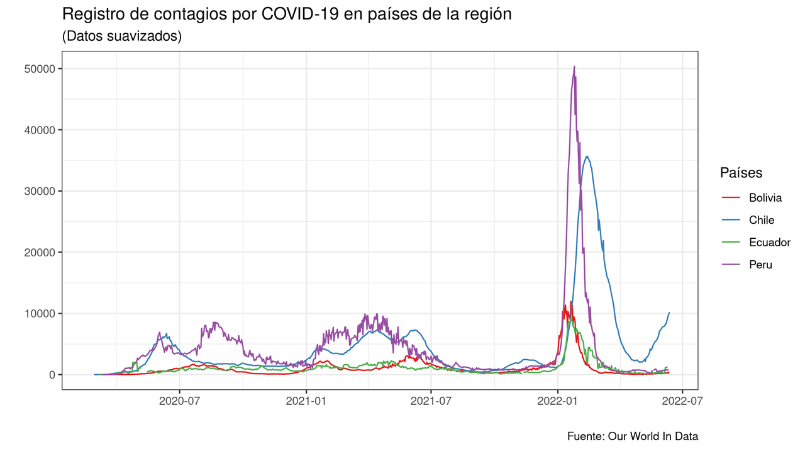
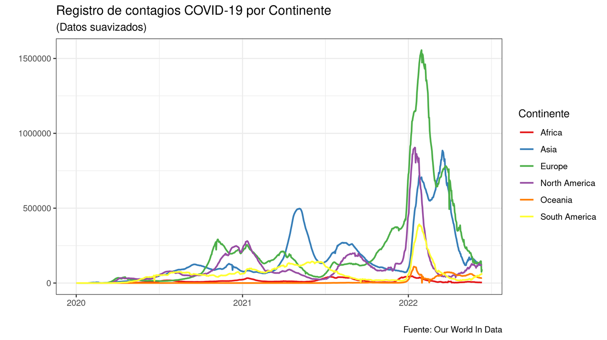
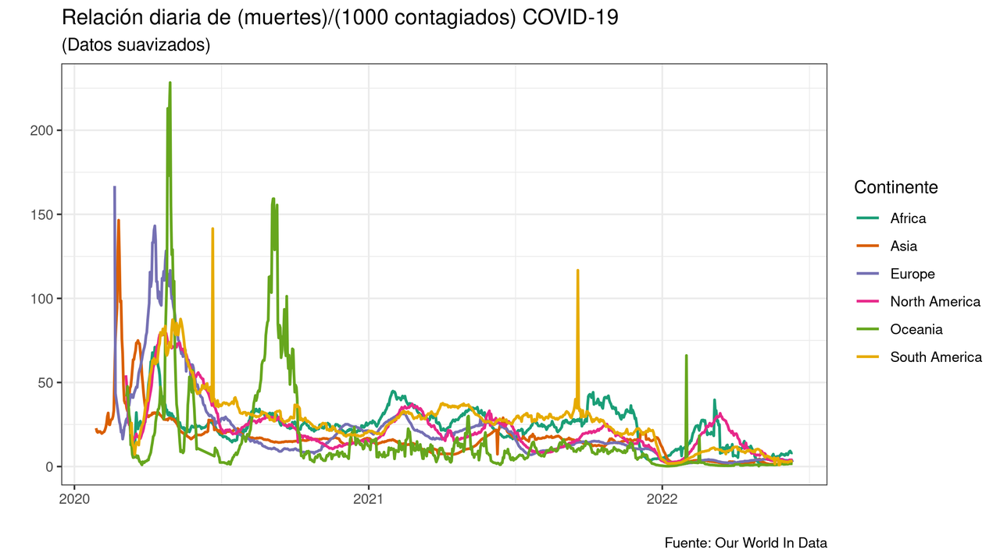

<!--
.. title: Cómo filtrar datos de tu tabla con dplyr en R
.. slug: filtrar-datos-r
.. date: 2022-06-14 19:52:05 UTC
.. author: Ever Vino
.. tags: open-science, r, filtrar-datos, dplyr, recursos, data-science
.. category: data-science
.. link: 
.. description: 
.. type: text
-->

<!-- # Cómo filtrar datos de tu tabla con dplyr en R  -->


En este artículo mostraremos como usar algunas funciones importantes de la biblioteca de `dplyr`, específicamente veremos como usar las funciones `filter()`, `select()`, `group_by()`, `sumarize()` y `mutate()` dentro de un ejemplo práctico.

<!-- TEASER_END -->

## Requisitos

Por comodidad usamos la biblioteca `pacman` como gestor de paquetes.

```r
# install.packages("pacman") Para instalar la biblioteca pacman
library(pacman) # Gestor de paquetes en R
p_load("readr") # Biblioteca para importar archivos csv
p_load("dplyr") # Biblioteca para manipular datos
p_load("ggplot2")   # Biblioteca para graficar datos

```

Recuerde, que tambien puede instalar y abrir las bibliotecas de manera tradicional, por ejemplo con: `install.packages("readr")`, luego abrir la misma biblioteca con `library(readr)`.

## Importando nuestros datos

La base de datos usada ha sido descargada de [Our World In Data](https://github.com/owid/covid-19-data), la cual muestra los datos recolectados de la reciente pandemia. Una vez descargada nuestra base de datos en formato `.csv`, la importamos a nuestro entorno de R. Puede descargar los archivos usados en este artículo [Repositorio de este artículo aquí](https://github.com/EverVino/Example_data_covid_r).

Importamos los el archivo `.csv` a la variable `covid_data`.

```r
covid_data <- read_csv("owid-covid-data.csv")
```

En la consola observamos lo siguiente:

```r
Rows: 193573 Columns: 67                                                                                                               
── Column specification ────────────────────────────────────────────────────────────────────────────
Delimiter: ","
chr   (4): iso_code, continent, location, tests_units
dbl  (62): total_cases, new_cases, new_cases_smoothed, total_deaths, new_deaths, new_deaths_smoo...
date  (1): date

ℹ Use `spec()` to retrieve the full column specification for this data.
ℹ Specify the column types or set `show_col_types = FALSE` to quiet this message.
```

Como puede ver esta tabla es muy extensa, contiene 67 columnas (variables) y  193573 filas, manejar los datos directamente de esta tabla puede ser complicado, por lo que se recomienda reducir las variables o extraer información relevante para nosotros.
Si quiere explorar los datos manualmente puede ejecutar la función `(View(datos_covid))` en la consola.

## Cómo usar la función filter() y select()

Queremos ver los datos de la región de Sudamérica (continent = "South America") y sólo las variables de país, fecha y nuevos casos que corresponderían a las columnas de location, date, new_cases respectivamente en el dataframe `datos_covid` (para graficar curvas suaves usamos la columna new_cases_smoothed en vez de new_cases).

Usando la función `filter()` y tenemos:

```r
# Filtramos los las filas que cumplan con la condición de que en su columna continent sea igual a "South America".
# Almacenamos lo deseado en la variable covid_sudamerica
covid_sudamerica <- filter(covid_data, continent == "South America")
# Filtramos las filas que no contengan valores en la columna de new_cases_smoothed, es decir valores iguales a NA.
covid_sudamerica <- filter(covid_sudamerica, !is.na(new_cases_smoothed))
# Seleccionamos sólo  las columnas que nos importan
covid_sudamerica <- select(covid_sudamerica, location, date, new_cases_smoothed)
```

**`filter(tabla, condicion)`**

Función que es usada para filtrar en filas, selecciona un subconjunto de filas que cumplan con la condicion
- **`tabla`** : Dataframe o tabla de donde va se va a filtrar datos.
- **`condicion`** : Prueba lógica que devuelve valores booleanos TRUE o FALSE, de esta condicion depende si la fila se incluye en la nueva tabla.

Para armar la condicion, puede usar los nombres de la columna como variables y usar los siguientes operadores lógicos:

* **`>`** : Corresponde a **mayor que**.
* **`==`** : Corresponde a **igual que**.
* **`>=`** : Corresponde a **mayor o igual que**.
* **`<=`** : Corresponde a **menor o igual que**.
* **`!=`** : Corresponde a **diferente que**.

Puede combinarlas las condiciones con:

* **`&`** : Operador AND.
* **`|`** : Operador OR.
* **`!`** : Operador NOT o negación.
* **`is.na(x)`** : Función que verifica si un dato es NA (Not Available/ Missing value), valor faltante o no disponible. Devuelve TRUE cuando x es NA.
* **`valor %in% vector`** : Operador que verifica si un valor existe en un vector. Devuelve TRUE cuando valor esta incluido en vector.

**`select(tabla, nombre_col, ...)`**
Función que filtra columnas por nombre de columna para un nueva tabla.

- **`tabla`** : Dataframe o tabla de donde va se va a filtrar datos.
- **`nombre_col`** : Nombre de la columna o variable que va a componer la nueva tabla.

## Operador Pipe `%>%`

Este operador nos permite combinar muchas operaciones en una sóla línea, una simple cadena de comandos.
Considere lo siguiente para entender el flujo de datos del operador Pipe `%>%`.

1. Tome *x*
2. use *x* como entrada para la función *f(x)*
3. use la salida de *f(x)* como entrada de la función *g(x)*
4. use la salida de *g(x)* como entrada de la función *h(x)*.

Simplificando tenemos *h(g(f(x)))* , esta es una expresión complicada para escribirla, su equivalente usando el operador Pipe (%>%) es:
*x %>% f() %>% g() %>% h()* que es mucho más entendible y fácil de escribir.

Usando el operador `%>%` podemos simplificar a una línea de comando encadenada, la obtención de nuestra variable `covid_sudamerica` de la sección anterior

```r
covid_sudamerica <-
  covid_data %>% 
  filter(continent == "South America" & !is.na(new_cases_smoothed)) %>% 
  select(location, date, new_cases_smoothed)
```

Para poder graficar este ejemplo lo vamos a reducir un poco más, obteniendo una tabla que sólo contenga países de la región.

```r
paises_andinos = c("Bolivia", "Peru", "Chile", "Ecuador")
covid_paises_region <-
  covid_data %>% 
  filter(location %in% paises_andinos) %>% 
  select(location, date, new_cases_smoothed)
```

Para observar nuestros datos obtenidos graficamos

```r
ggplot(covid_paises_region) + 
geom_line(aes(x = date, y = new_cases_smoothed, color = location), size = 0.5) +
  scale_color_brewer(palette = "Set1") + theme_bw() + 
  labs(
    x = "",
    y = "",
    title = "Registro de contagios diario en países de la región por COVID-19",
    subtitle = "(Datos suavizados)",
    caption = "Fuente: Our World In Data",
    color = "Países"
  )

```




## Cómo usar summarise() y group_by()

Si, queremos saber el total de contagiados y el total de días desde que se registraron los contagios podemos usar `summarize()`

```r
summarise(
  covid_paises_region,
  total = sum(new_cases_smoothed, na.rm = TRUE),
  dias = n_distinct(date)
)
```

Ejecutanto obtenemos en la consola:

```
# A tibble: 1 × 2
     total  dias
     <dbl> <int>
1 9174748.   841
```

**`summarise(tabla, nueva_columa = funcion_vector(columna_tabla), ...)`**
Función que crea una nueva tabla a partir de la agrupación de columnas de una tabla anterior, los valores de la nueva columna dependen también del tipo de función vector que se use para agruparlas.

- **`tabla`**: Dataframe o tabla de donde sus columnas servirán para contruir la nueva tabla.
- **`nueva_columna`**: nueva columna o variable creada a partir de las anteriores columnas.
- **`funcion_vector()`**: función que devuelve un solo valor a partir de un vector.

Algunas funciones que se pueden usar como función vector son:

* **`sum(vector)`** : Devuelte la suma de los componentes de `vector`.
* **`mean(vector)`** : Devuelve el valor promedio de los valores de `vector`.
* **`min(vector)`** : Devuelve el valor mínimo de los valores de `vector`.
* **`max(vector)`** : Devuelve el valor mínimo de los valores de `vector`.
* **`n_distinc(vector)`** : Devuelve el conteo de los valores diferentes dentro de `vector`.
* **`n(vector)`** : Devuelve el conteo de los valores dentro de `vector`.
* **`sd(vector)`** : Devuelve la desviación estandar de los valores de `vector`.

Todas las funciones tienen la opción `ra.rm` para omitir o pasar por alto los valores que sean NA (No Applicable/Missing values) durante los cálculos, por ejemplo puede usar `mean(vector, na.rm = TRUE)` para calcular el promedio de `vector` descartando los datos que sean NA.

La función summarise() agrupa todos los datos de una columna, y devuelve un sólo valor por columna.

Para el ejemplo, si quisieramos no obtener el total sino el total por países usamos la función `group_by()`.

```r
total_covid_paises_region <-
    covid_paises_region %>% group_by(location) %>% 
    summarise(total_contagios = sum(new_cases_smoothed, na.rm = TRUE))

total_covid_paises_region
```

Ejecutando, observamos en la consola:

```r
# A tibble: 4 × 2
  location total_contagios
  <chr>              <dbl>
1 Bolivia          911503.
2 Chile           3785492.
3 Ecuador          889635.
4 Peru            3588117.
```
_Nota: estos son resultados de datos suavizados_

**`group_by(tabla, columna_1, columna_2 ...)`**
Agrupa varias filas en una sola, las agrupa si y sólo si tienen el mismo valor en columna_1, luego las agrupa por valores en la  columna_2 y así sucesivamente. Esta función siempre va acompañada de la función `summarise()`

- **`tabla`**: Dataframe o tabla de donde sus columnas servirán para contruir la nueva tabla.
- **`columna_n`**: nombre la columna de la cual se van a agrupar los valores con la función `summarise()`.

Hagamos algo más interesante, queremos ver la evolución del contagios de COVID-19 por continentes.

```r
covid_continentes <-
  covid_data %>% 
  group_by(continent, date) %>% 
  summarise(total_contagios = sum(new_cases_smoothed, na.rm = TRUE)) %>% 
  filter(!is.na(continent))
```

Graficando los resultados

```r
ggplot(covid_continentes) + 
  geom_line(aes(x = date, y = total_contagios, color = continent), size = 0.8) +
  scale_color_brewer(palette = "Set1") + theme_bw() + 
  labs(
    x = "",
    y = "",
    title = "Registro de contagios COVID-19 por Continente",
    subtitle = "(Datos suavizados)",
    caption = "Fuente: Our World In Data",
    color = "Continente"
  )
```



## Para que sirve la función mutate()

Una buen indicador, para saber si hemos mejorado el tratamiento y prevención contra la COVID-19 es hallar la relación entre el  muertes por cada 1000 contagiados (mientras menor valor tenga la variable, mejor estamos preparados para afrontar la COVID). Llamemos a esta nueva variable `indicador`, esta dependera de otras para su cálculo, la función `mutate()` no ayudará a calcularla.

_Puede que no sea excelente indicador y que no refleje muy bien lo que se quiere, pero para propositos de este ejemplo nos servirá_

```r
# Obtenemos nuestros datos que nos van a ayudar a calcular el indicador
# Filtramos los valores que sean iguales a 0 y los datos NA con filter()
covid_continentes_indicador <-
  covid_data %>% 
  group_by(continent, date) %>% 
  summarise(nuevos_casos = sum(new_cases_smoothed, na.rm = TRUE), nuevas_muertes = sum(new_deaths_smoothed, na.rm = TRUE)) %>% 
  filter(!is.na(continent) & nuevos_casos != 0 & nuevas_muertes != 0)
```

Usamos la función mutate para obtener nuestro indicador

```r
covid_continentes_indicador <- 
  covid_continentes_indicador %>% 
  mutate(indicador = nuevas_muertes/nuevos_casos*1000)
```

**`mutate(tabla, nueva_columna_1 = f(columna_1, columna_2...), nueva_columna_2 = f(columna_n, ...)... )`**
Crea una nuevas columnas las modifica a partir de los datos de otras columnas.

- **`tabla`** : Dataframe o tabla de donde sus columnas servirán para obtener  la nueva tabla.
- **`nueva_columna_n`** : Nombre la nueva columna que se crea a partir de otras columnas.
- **`columna_n`** : Nombre la columna o variable de la `tabla`.
- **`f(columna_1, columna_2, ...)`** : Representa la combinación algebraica de las variables que van a devolver el nuevos valores de la nueva_columna_n. (Observe que usamos nombre de la columna y variable como sinónimos)

Mostrando los resultados en una gráfica

```r
ggplot(covid_continentes_indicador) + 
  geom_line(aes(x = date, y = indicador, color = continent), size = 0.8) +
  scale_color_brewer(palette = "Dark2") + theme_bw() + 
  labs(
    x = "",
    y = "",
    title = "Relación diaria de (muertes)/(1000 contagiados) COVID-19",
    subtitle = "(Datos suavizados)",
    caption = "Fuente: Our World In Data",
    color = "Continente"
  )
```


## Conclusiones

Las funciones mostradas en el árticulo son las más usadas y permiten una mejor manipulación de datos en R. Como siempre es bueno revisar la [documentación oficial](https://www.rdocumentation.org) de los correspondientes paquetes si se quiere aprender más.

Puede descargar el [repositorio de este artículo aquí](https://github.com/EverVino/Example_data_covid_r).

## Referencias

[Our World In Data](https://github.com/owid/covid-19-data)

[Documentacion de R](https://www.rdocumentation.org)
