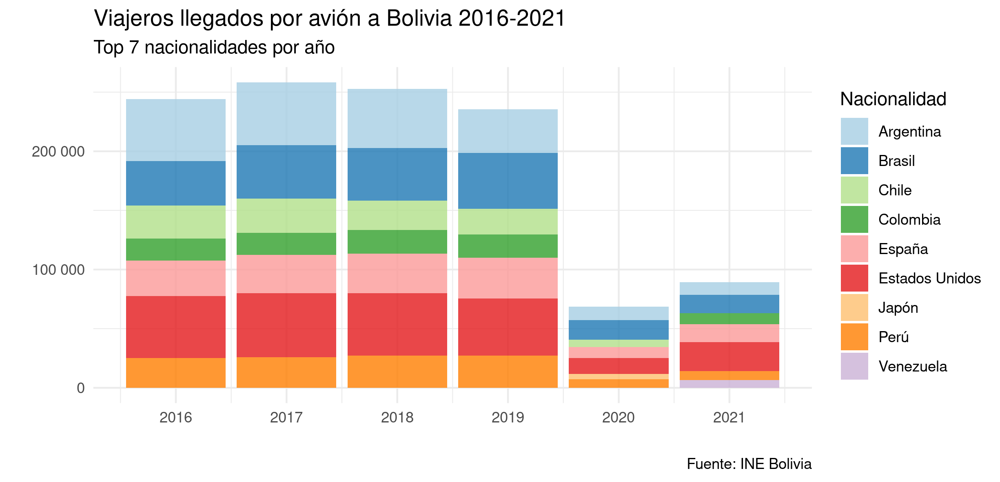

<!--
.. title: Reorganiza tu tabla con tidyr en R
.. slug: reorganiza-tus-tablas-con-tidyr
.. date: 2022-07-17 19:52:05 UTC
.. author: Ever Vino
.. tags: open science, r, filtrar datos, tidyr, data science, columnas a filas, filas a columnas
.. category: data science
.. link: 
.. description: 
.. type: text
-->

<!-- # Reorganiza tu tabla con tidyr en R  -->


En este artículo, modificaremos la forma de nuestra tabla, combinando varias columnas en una sola o viceversa, usando la biblioteca `tidyr` con sus funciones `gather()`, `spread()`, `separate()`, y `unite()` con ejemplos.

<!-- TEASER_END -->

## Requisitos

Por comodidad usamos la biblioteca `pacman` como gestor de paquetes.

```r

# install.packages("pacman") Para instalar la biblioteca pacman
library(pacman) # Gestor de paquetes en R
p_load("readr") # Biblioteca para importar archivos csv
p_load("tidyr") # Biblioteca para manipular datos
p_load("ggplot2")   # Biblioteca para graficar datos
p_load("dplyr")  # Biblioteca para filtrar datos de la tabla
p_load("zoo") # Biblioteca para transformar fechas a trimestres
p_load("scales") # Biblioteca para dar formato de miles en el eje "y"

```

Recuerde, también puede instalar y abrir las bibliotecas de manera tradicional, por ejemplo con: `install.packages("tidyr")`, luego abrir la misma biblioteca con `library(tidyr)`.

## Importando nuestros datos

La base de datos usada, ha sido descargada de [La base de datos de Instituto de Estadística de Bolivia (INE)](https://www.ine.gob.bo/). Descargada la base de datos se la modifica para que se encuentre en formato `.csv` y la importamos a nuestro entorno de R.

Puede descargar los archivos usados en este artículo [Repositorio de este artículo aquí](https://github.com/EverVino/Example_data_tidyr).

Importamos el archivo `.csv` a la variable `datos_turistas`.

```r

covid_data <- read_csv("turistas.csv")

```

En la consola observamos lo siguiente:

```r

Rows: 44 Columns: 169                                                                                                     
── Column specification ───────────────────────────────────────────────────────────────
Delimiter: ","
chr   (1): Nacionalidad
dbl (168): 31/01/08, 28/02/08, 31/03/08, 30/04/08, 31/05/08, 30/06/08, 31/07/08, 31...

ℹ Use `spec()` to retrieve the full column specification for this data.
ℹ Specify the column types or set `show_col_types = FALSE` to quiet this message.

```

Nuestra tabla tiene varias columnas correspondientes al acumulativo por mes, si queremos graficar estos datos con `ggplot()` estos datos no nos van a ser de mucha utilidad. Por ello vamos a usar `gather()` para convertir las fechas de las columnas en datos de una sola columna.

Si quiere explorar los datos manualmente puede ejecutar la función `(View(datos_turistas))` en la consola.

## Cómo usar la función gather()

La función `gather()` puede agrupar muchas los nombres de las columnas en una sola, así como se muestra en la siguiente animación.


En nuestro caso quremos hacer algo similar, agrupar las fechas en una columna llamada `Fecha`.

```r

# A tibble: 6 × 169
  Nacionalidad   `31/01/08` `28/02/08` `31/03/08` `30/04/08` `31/05/08` `30/06/08`
  <chr>               <dbl>      <dbl>      <dbl>      <dbl>      <dbl>      <dbl>
1 Estados Unidos       2795       2365       2055       2258       2058       4141
2 Argentina            2304       1603       1780        869       2534       1293
3 Brasil               2996       3041       1499       3215        964       1128
4 Chile                1323       1195       1021       1115        754       1076
5 España               1050        875        721        727        744        670
6 Perú                 1141        909        841        806        661       1438
# … with 162 more variables …

```

Usando la función `gather()` tenemos:

```r

datos_turistas <-
  gather(data = datos_turistas,
         key = Fecha,
         value = Turistas,
         2:ncol(datos_turistas))

# ncol(tabla) Devuelve el número de columnas de tabla

```

Ejecutando head(datos_turistas), notamos que hemos obtenido lo deseado.

```r

# A tibble: 6 × 3
  Nacionalidad   Fecha    Turistas
  <chr>          <chr>       <dbl>
1 Estados Unidos 31/01/08     2795
2 Argentina      31/01/08     2304
3 Brasil         31/01/08     2996
4 Chile          31/01/08     1323
5 España         31/01/08     1050
6 Perú           31/01/08     1141

```

**`gather(data, key, value, ...)`**

Función que es usada para agrupar columnas en dos nuevas columnas.

- **`data`** : Dataframe o tabla que se va a modificar.
- **`key`** : Nombre de la nueva columna que va almacenar los *nombres de la columnas* que se van a agruparse.
- **`value`** : Nombre de la nueva columna que va contener los *valores de la columnas* que se van a agruparse.
- **`...`** : Nombres o selección de columnas a agruparse, puede usar los nombres de las columnas con la función concatenar `c()`. Ejemplo `c(nombre_col1, nombre_col2...)`  ó hacer la selección del complemento con `!c()`, también puede usar como referencia el número de columna. Para hacer referencia a una serie sucesiva use `:`  Ejemplo: `n_col1:n_col2`.

## Separa una columna con separate()

Para ejemplificar el operador `separate()` vamos a separar la columna `Fecha` en las columnas `día`, `mes` y `año`.

```r

datos_turistas <-
  separate(datos_turistas,
    col = Fecha,
    into = c("día", "mes", "año"),
    sep = "/",
    remove = FALSE
  )

```

Podemos observar en la consola.

```r

> head(datos_turistas)
# A tibble: 6 × 6
  Nacionalidad   Fecha    día   mes   año   Turistas
  <chr>          <chr>    <chr> <chr> <chr>    <dbl>
1 Estados Unidos 31/01/08 31    01    08        2795
2 Argentina      31/01/08 31    01    08        2304
3 Brasil         31/01/08 31    01    08        2996
4 Chile          31/01/08 31    01    08        1323
5 España         31/01/08 31    01    08        1050
6 Perú           31/01/08 31    01    08        1141

```

**`separate(data, col, into, sep, remove)`**

Función que es usada para separar una columna en varias.

- **`data`** : Dataframe o tabla que se va a modificar.
- **`col`** : Nombre de la columna que va a separarse.
- **`into`** : Nombres de la nuevas columnas que van a crearse a partir de `col`. Puede usar para nombrar a las columnas la función concatenar `c()`.
- **`sep`** : Separador, un caracter que va a servir para identificar en donde se separa para generar las nuevas columnas. Puede usar *Regular Expresions*.
- **`remove`** : Acepta valores booleanos `TRUE` y `FALSE`, por defecto es `TRUE`, si es igual `TRUE` borra la columna que se separa, en `FALSE` la mantiene.

Vamos a aprovechar los nuevos datos generados, para graficar el top de turistas que han visitado Bolivia en los años 2016-2021.

En el código abajo usamos muchas funciones de la biblioteca `dplyr` si quiere aprender más sobre esa biblioteca puede leer [este artículo](https://opensciencelabs.org/blog/filtrar-datos-r/filtrar-datos-r/).

```r

# Añadimos "20" al año y lo convertimos a variable entera.
datos_turistas$año <-
  as.integer(paste("20", datos_turistas$año, sep = ""))

# Filtramos por año
datos_turistas_2016_2021 <- 
  datos_turistas %>% 
  filter(as.integer(año) >= 2016, na.rm =TRUE)

# Agrupando por Nacionalidad y año
datos_turistas_2016_2021 <- 
  datos_turistas_2016_2021 %>%
  group_by(Nacionalidad, año) %>%
  summarise(turistas_anuales = sum(Turistas))

#Extrayendo los top turistas visitantes de Bolivia
top_turistas_2016_2021 <- 
  datos_turistas_2016_2021 %>% 
  arrange(desc(turistas_anuales)) %>%
  group_by(año) %>% 
  slice(1:7)

# Graficando con ggplot2
ggplot(data = top_turistas_2016_2021) +
  geom_bar(
    aes(x = año, y = turistas_anuales, fill = Nacionalidad),
    stat = "identity",
    alpha = 0.8
  ) +
  theme_minimal() + scale_fill_brewer(palette = "Paired") +
  scale_x_continuous(breaks = c(2016:2021)) +
  scale_y_continuous(labels = comma_format(big.mark = " ")) +
  labs(
    x = "",
    y = "",
    fill = "Nacionalidad",
    title = "Viajeros llegados por avión a Bolivia 2016-2021",
    subtitle = "Top 7 nacionalidades por año",
    caption = "Fuente: INE Bolivia"
  )

```



## Función unite()

Unite es una función complementaria a `separate()` y hace lo contrario, une las columnas en un sola.
Vamos a usarlo para juntar las columnas de `mes` y `año`.

```r

datos_turistas_trimestre <- 
  unite(datos_turistas, mes_año, c("mes","año"), sep = "-")

```

Observando en la consola:

```r

> head(datos_turistas_trimestre)
# A tibble: 6 × 5
  Nacionalidad   Fecha    día   mes_año Turistas
  <chr>          <chr>    <chr> <chr>      <dbl>
1 Estados Unidos 31/01/08 31    01-2008     2795
2 Argentina      31/01/08 31    01-2008     2304
3 Brasil         31/01/08 31    01-2008     2996
4 Chile          31/01/08 31    01-2008     1323
5 España         31/01/08 31    01-2008     1050
6 Perú           31/01/08 31    01-2008     1141

```

**`unite(data, col, ..., sep, remove)`**

Función que une varias columnas en una.

- **`data`** : Dataframe o tabla que se va a modificar.
- **`col`** : Nombre de la nueva columna que va a unir otras columnas.
- **`... `** : Nombres de la nuevas columnas que van a juntarse en `col`. Puede usar para nombrar las columnas la función concatenar `c()`.
- **`sep`** : Separador, un caracter que va a servir para unir los valores de las columnas que se unen.
- **`remove`** : Acepta valores booleanos `TRUE` y `FALSE`, por defecto es `TRUE`, si es igual TRUE borra la columnas que se unen, en `FALSE` las mantiene.

## Función spread()

Esta función es la que complementa a la función `gather()`, y hace exactamente lo contrario. esparcir una columna en varias.

Antes de utilizar `spread()` vamos a agrupar nuestro datos en trimestres.

```r

# Agrupamos los datos por trimestres
datos_turistas_trimestre <- datos_turistas_trimestre %>%
  mutate(trimestre = as.yearqtr(mes_año, format ="%m-%Y")) %>%
  group_by(Nacionalidad, trimestre) %>%
  summarise(turistas_trimestre = sum(Turistas))

# También podemos utilizar la columna `Fecha` para transformar a trimestres, con el argumento `format=%d/%m/%y`

```

En la consola podemos ver

```r

> head(datos_turistas_trimestre)
# A tibble: 6 × 3
# Groups:   Nacionalidad [1]
  Nacionalidad trimestre turistas_trimestre
  <chr>        <yearqtr>              <dbl>
1 Alemania     2008 Q1                 3318
2 Alemania     2008 Q2                 1392
3 Alemania     2008 Q3                 1458
4 Alemania     2008 Q4                 1516
5 Alemania     2009 Q1                 4008
6 Alemania     2009 Q2                 1646

```

Ahora podemos usar `spread()`, para expandir los datos de la columna trimestre en columnas independientes.

```r

# Mostar en columnas los valores de trimestre 
datos_turistas_trimestre <-
  spread(
    data = datos_turistas_trimestre, 
    key = trimestre, 
    value = turistas_trimestre)

```

Ahora observamos que nuestros datos se han esparcido, este formato es útil para visualización de datos en otros frameworks.

```r

> head(datos_turistas_trimestre)
# A tibble: 6 × 57
# Groups:   Nacionalidad [6]
  Nacionalidad `2008 Q1` `2008 Q2` `2008 Q3` `2008 Q4` `2009 Q1` `2009 Q2` `2009 Q3`
  <chr>            <dbl>     <dbl>     <dbl>     <dbl>     <dbl>     <dbl>     <dbl>
1 Alemania          3318      1392      1458      1516      4008      1646      1924
2 Argentina         5687      4696      8537      6884      4734      4667      5810
3 Australia          988      1269       944      1384       980       771      1253
4 Austria            587       176       221       300       632       206       293
5 Bélgica           1029       246       784       602      1504       556       531
6 Brasil            7536      5307      7199      5693      4178      5941      9843
# … with 49 more variables …

```

**`spread(data, key, value)`**

Función que es usada para esparcir los datos de una como nombres de columnas.

- **`data`** : Dataframe o tabla que se va a modificar.
- **`key`** : Nombre de la columna cuyos valores se van esparcir como los *nombres de la  nuevas columnas*.
- **`value`** : Nombre de la columna cuyos valores van a convertirse en los  *nuevos valores de las nuevas columnas*.

Aprovechemos estos datos para graficar los top países que han visitado Bolivia en el primer trimestre  del 2019.

```r

top_turistas_trimestre_1_2019 <-
  datos_turistas_trimestre %>% 
  select(Nacionalidad, `2019 Q1`) %>%
  rename(trimestre1_2019= `2019 Q1`) %>%
  arrange(desc(trimestre1_2019)) %>% as.data.frame() %>%
  slice_head(n = 10)

```

Graficando

```r

ggplot(data = top_turistas_trimestre_1_2019) +
  geom_bar(aes(x=Nacionalidad, y=trimestre1_2019, fill=Nacionalidad), stat="identity", alpha = 0.8)+
  theme_minimal() + scale_fill_brewer(palette = "Paired")+
  scale_y_continuous(labels = comma_format(big.mark=" ")) +
  labs(
    x = "",
    y = "",
    fill = "Nacionalidad",
    title = "Viajeros llegados por avión a Bolivia Primer Trimestre 2019",
    subtitle = "Top 10 nacionalidades",
    caption = "Fuente: INE Bolivia"
  )
#p_unload(all) #Ejecute esta línea de comando para cerrar las bibliotecas abiertas con "pacman"

```


## Outro

Las funciones mostradas en el árticulo son las más usadas y permiten una mejor manipulación de datos en R. Como siempre es bueno revisar la [documentación oficial](https://www.rdocumentation.org) si se quiere aprender más.

Puede descargar el [repositorio de este artículo aquí](https://github.com/EverVino/Example_data_tidyr).

## Referencias

- [Git Hub Issues tidyr](https://github.com/tidyverse/tidyr/issues/515)

- [Instituto de Estadística de Bolivia (INE)](https://www.ine.gob.bo/)

- [Documentación de R](https://www.rdocumentation.org)
