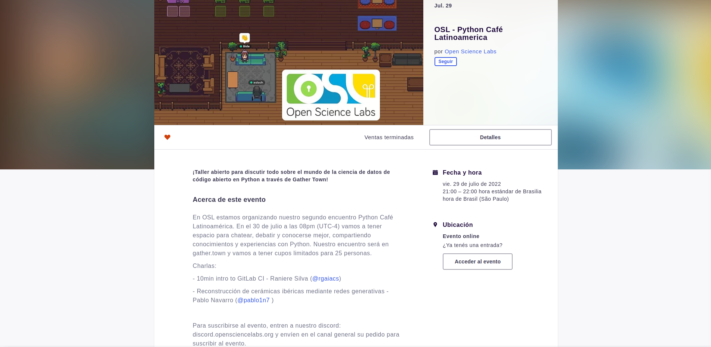

<!--
.. title: PyCafé+Talks Latinoamérica
.. slug: en
.. date: 2022-08-04
.. author: Luã Bida Vacaro
.. tags: meeting, talks
.. category: meeting
.. link: 
.. description: 
.. type: text
-->
  

<!-- # [EN] Guia de funcionamento do PyCafé -->

  

## An intro to PyCafé Latinoamérica

  

  

PyCafé is an event organized by Open Science Labs, open to public, aiming to join together people interested in learning all kind of subjects related to the Open Source world with Python. The name "PyCafé" comes from the idea of having a virtual space where everyone can interact, chat and share experiences, as if we were in a cafe talking about technology.
  

### The Virtual Space in [Gather Town](https://app.gather.town/)

  
Ir order to get everyone close, we decided to create a room on [Gather](https://app.gather.town/app/p5D97jKFqewvbIcn/Open%20Science%20Labs%20Cafe). Gather is an interactive Video Call app, where you can get together with other people connected to the room, share your image and screen, chat, and more! 

  

#### Spotlight and proximity system

  
Our cafe was built so we can have the best experience during the Talks. At the beginning of the room (inside the orange space delimited by 📢), is the **spotlight** area. Inside this area, everyone in the cafe can listen to your microphone.
By leaving this area, only people next to you are able to hear your voice. In case you sit in one of the tables, only people in the same table will hear you.

### The Talks and its subjects

A Talk is a short presentation, in general within 10 to 15 minutes, introducing a concept, Framework, Lib or Project in Python. The subjects can approach any area, since it's aimed to the Open Source community. The presentation can be a moment to share a Framework you use, but also can introduce good Issues to start collaborating with Open Source Projects, workflow demonstrations, benefits of collaborating, etc.  

Since Open Science Labs is a Latin American community, to be accessible to the participants, is preferable that the Talks are in Spanish or Portuguese, although there is no problem to present them in English. After every Talk a few minutes are opened to questions and comments, where everyone can participate. In our [Twitter](https://twitter.com/opensciencelabs) and [Linkedin](https://www.linkedin.com/company/open-science-labs/) we announce more information about next PyCafés e Talks.

### How to join the event

Our Gather Town space is limited to 25 people at the same time. So we use [Eventbrite](https://eventbrite.com/)  with free tickets, to ensure everyone will receive the email and calendar notification. There it will some information about scheduled talks and the hosts:

  
#### Give a Talk!

To people interested in giving Talks, we ask to send a request via our  [Discord](http://discord.opensciencelabs.org) server, including the title of the Talk. The Open Science Labs community is open to everybody that wants to share knowledge and Open Source experiences, no matter the expertise or skill, in a open and inclusive way.  
