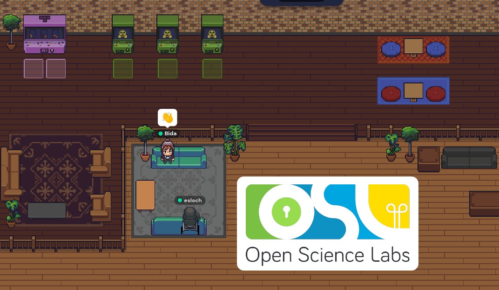
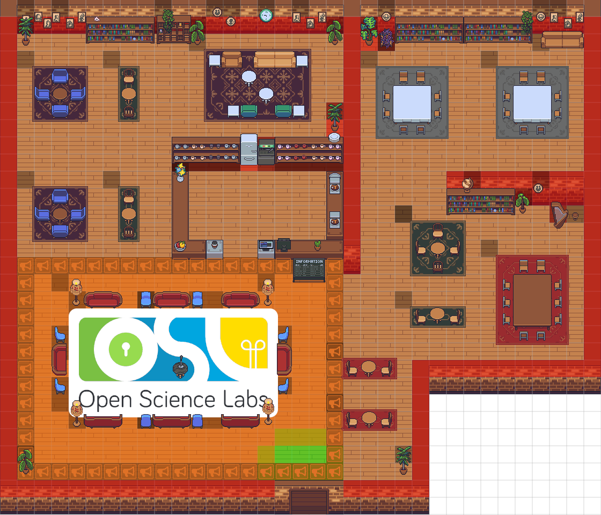
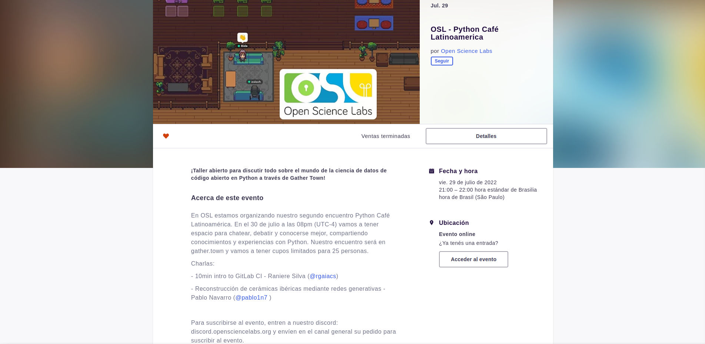

<!--
.. title: PyCafé+Talks Latinoamérica
.. slug: pt
.. date: 2022-08-02
.. author: Luã Bida Vacaro
.. tags: meeting, talks
.. category: meeting
.. link: 
.. description: 
.. type: text
-->

<!-- # [PT] Guia de funcionamento do PyCafé -->

## O que é o PyCafé Latinoamérica?

 

 PyCafé é um evento realizado pela Open Science Labs, aberto ao público, com o objetivo de reunir pessoas interessadas em aprender todos os tipos de assuntos relacionados ao mundo Open Source com Python. O nome PyCafé vem da ideia de unir todos em um ambiente virtual, onde possamos interagir, conversar e compartilhar conhecimento, como se estivessemos em um café conversando sobre tecnologia.

### Ambiente virtual do [Gather Town](https://app.gather.town/)

 Pensando em aproximar os participantes, decidimos criar uma sala no [Gather](https://app.gather.town/app/p5D97jKFqewvbIcn/Open%20Science%20Labs%20Cafe). O Gather é um app de videochamadas interativo, onde você pode se reunir com outras pessoas conectadas à sala, compartilhar sua imagem e tela, conversar pelo chat e muito mais!

 

#### Spotlight e sistema de proximidade

 Nosso Café foi construído para que tenhamos a melhor experiência durante as apresentações. No início do ambiente (dentro do espaço delimitado por 📢 laranjas), é a área de **spotlight**. Dentro desta área, todas as pessoas no Café ouvem o microfone de quem estiver falando. 
 Ao sair desta área, apenas pessoas próximas a você são capazes de ouvir sua voz, e caso sente-se em uma das mesas, só quem estiver sentado nela irá lhe ouvir.

### O que são as Talks e quais assuntos são abordados?

 Uma Talk é uma apresentação curta, geralmente entre 10 a 15 minutos, introduzindo um conceito, Framework, Lib ou Projeto em Python. Os assuntos podem abrangir qualquer área, desde que seja de intresse para a comunidade Open Source. As apresentações podem ser voltadas apenas para apresentação de Projetos que tenham usabilidade para os desenvolvedores, mas também podem incluir Issues que são bem-vindas para novos colaboradores, demonstrações de como seria o Fluxo de Trabalho para contribuirem, quais seriam os benefícios de aprendizagem, etc.
 
 Como a Open Scince Labs é uma comunidade Latinoamericana, para ser acessível aos participantes é preferível que a Talk seja em Espanhol ou Português, apesar de não haver problemas em apresentá-la em Inglês. Após cada Talk, abre-se espaço para dúvidas e comentários, onde todos podem participar e conversar sobre o que foi apresentado. Em nosso [Twitter](https://twitter.com/opensciencelabs) e [Linkedin](https://www.linkedin.com/company/open-science-labs/) divulgamos todas as informações sobre futuros PyCafés e Talks.

### Como participar do PyCafé?

 Como a sala do Gather Town possui limitação de 25 participantes. Utilizamos o [Eventbrite](https://eventbrite.com/) para coordenação dos participantes, onde um evento de divulgação é criado, com tickets grátis, para que as pessoas interessadas possam receber novidades via email e sincronizar a data do evento com seus calendários.

 
 

#### Dê sua Talk!

 Para as pessoas interessadas em apresentar as Talks, um pedido deve ser realizado em nosso servidor do [Discord](http://discord.opensciencelabs.org), com o título da Talk. A comunidade Open Science Labs está aberta a todas as pessoas se interessem em difundir ideias Open Source e incentivamos, independente do nível de experiência, o compartilhamento de conhecimento de maneira aberta e inclusiva.

